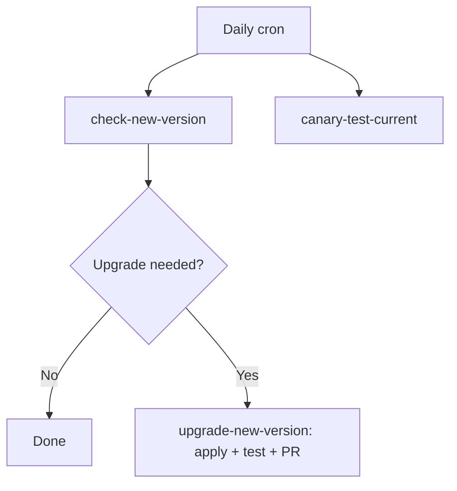

# AI Canary Sandbox

[](https://github.com/dcpanda/sandbox-ai-canary/actions/workflows/autonomous-upgrade.yml)

A business-domain AI agent that tests new LLM/library versions with the same tool-calling patterns as your production app.

## Why this exists

Every engineering team needs a canary that exercises their actual LLM + tool patterns before deploying a library or model upgrade. This sandbox:

1. **Mimics your production domain** — a customer support ticket triage system that uses tool calling, structured output, and multi-turn conversations
2. **Exercises the same LangChain4j contracts** — `@Tool` annotations, tool execution flow, and structured response parsing
3. **Switches models on demand** — run the same prompts against different providers to find breaking changes with minimal token cost

## Quick Start

```bash
# Default: fake model (deterministic, no API keys needed)
mvn spring-boot:run

# Test with Ollama
mvn spring-boot:run -Dspring-boot.run.arguments="--canary.model.provider=ollama --ollama.model.name=gemma4"

# Test with OpenAI
OPENAI_API_KEY=sk-xxx mvn spring-boot:run -Dspring-boot.run.arguments="--canary.model.provider=openai"
```

On startup, the agent runs the full evaluation suite and prints a comparison report. The HTTP server also starts on port 8080.

## How to use for version comparison

```bash
# Step 1: Run with your current model
mvn spring-boot:run -Dspring-boot.run.arguments="--canary.model.provider=ollama --ollama.model.name=gemma4"

# Step 2: Run with the candidate model
mvn spring-boot:run -Dspring-boot.run.arguments="--canary.model.provider=ollama --ollama.model.name=llama3"

# Step 3: Compare the tool call patterns and structured output
# Run the eval suite to verify the LangChain4j contract is stable
mvn test
```

## Business Domain

The canary uses a **Customer Support Ticket Triage** scenario that mirrors common enterprise AI patterns:

| Tool | Purpose | Production Equivalent |
|------|---------|-----------------------|
| `lookupCustomer(CUST-XXXX)` | Fetch customer account details | Customer API lookup |
| `lookupTicket(TKT-XXXX)` | Retrieve ticket information | Ticketing system query |
| `listCustomerTickets(CUST-XXXX)` | List a customer's active tickets | Customer history API |
| `updateTicketStatus(TKT-XXXX, STATUS)` | Escalate/close a ticket | Ticketing system write API |
| `listActiveTickets(filter)` | Dashboard of critical issues | Internal ops dashboard |

## LangChain4j Contracts Tested

- `@Tool` annotation parsing and tool discovery
- Tool execution request format (name + arguments)
- Structured output mapping (TriageResult record)
- Multi-turn conversation memory (tested via EVAL-13)
- ChatModel interface stability

## Configuration

Configured via `src/main/resources/application.yml` or CLI overrides:

| Property | Default | Description |
| :--- | :--- | :--- |
| `canary.model.provider` | `fake` | `fake`, `ollama`, or `openai` |
| `ollama.base.url` | `http://localhost:11434` | Ollama endpoint |
| `ollama.model.name` | `llama3` | Model to test |
| `openai.api.key` | `demo` | OpenAI API key |
| `langsmith.tracing` | `false` | Enable LangSmith trace capture |

## Running Tests

```bash
# All evals (deterministic, fast) — 22 tests
mvn test

# Live Ollama test (requires OLLAMA_BASE_URL)
OLLAMA_BASE_URL=http://localhost:11434 mvn test -Dtest=CanaryAgentEvalTest#liveOllamaTest

# Live OpenAI test (requires OPENAI_API_KEY)
OPENAI_API_KEY=sk-xxx mvn test -Dtest=CanaryAgentEvalTest#liveOpenAITest
```

### Test suite (EVAL inventory)

| ID | Name | What it validates |
|----|------|-------------------|
| EVAL-01–04 | Tool contract | `@Tool` discovery, method count, description parsing |
| EVAL-05–09 | Agent responses | Triage result generation, customer/ticket/dashboard queries |
| EVAL-10–11 | Mock data | All mock entities exist; missing IDs return empty |
| EVAL-12 | Error handling | Unknown ticket IDs produce valid results |
| EVAL-13 | Memory | Multi-turn conversation preserves context |
| EVAL-14 | No-tool path | Greeting produces LOW urgency, not a tool call |
| EVAL-15 | Invalid customer | Non-existent customer IDs are handled |
| EVAL-16 | Minimal input | Short queries don't crash |
| EVAL-17 | Full suite report | `runFullSuiteReport()` completes and prints |
| EVAL-18 | updateTicketStatus | Status change produces valid JSON |
| EVAL-OLLAMA | Live Ollama | (gated by `OLLAMA_BASE_URL`) |
| EVAL-OPENAI | Live OpenAI | (gated by `OPENAI_API_KEY`) |

## REST API

The canary starts an HTTP server on port 8080:

```bash
# Ask a question (GET)
curl "http://localhost:8080/api/canary/ask?q=Look%20up%20customer%20CUST-4401"

# Ask a question (POST)
curl -X POST "http://localhost:8080/api/canary/ask" \
  -H "Content-Type: text/plain" \
  -d "Triage for customer CUST-5512, ticket TKT-1004"

# Run the prebuilt canary check
curl "http://localhost:8080/api/canary/check"
```

## Architecture

```
CanaryAgent (AiService)
  ├── ChatModel (fake/ollama/openai)
  ├── CustomerLookup (@Tool: lookupCustomer, lookupTicket, listCustomerTickets)
  ├── TicketUpdater (@Tool: updateTicketStatus, listActiveTickets)
  └── MockTicketDatabase (deterministic test data, single source of truth)

AgentController (REST /api/canary/ask)
CommandLineRunner   → prints eval report on startup
CanaryEvaluator     → runFullSuiteReport() for model comparisons
```

The `FakeChatModel` simulates the full multi-turn LangChain4j agent loop:
1. Detects tool-calling intent in the user prompt (customer ID, ticket ID, or triage query)
2. Returns an `AiMessage` with `ToolExecutionRequest` that AiServices executes
3. On the follow-up turn (after tool results), produces a structured triage summary

This exercises the same contracts that a real LLM provider would — just deterministically.

## Autonomous Upgrade Canary (CI/CD)

The GitHub Actions workflow (`.github/workflows/autonomous-upgrade.yml`) runs daily:

1. **`check-new-version`** — fetches the latest LangChain4j and Spring Boot versions from Maven Central, compares with pinned versions (excludes RC/alpha/beta)
2. **`upgrade-new-version`** — if an upgrade is found, applies it to `pom.xml`, runs the test suite, and creates a PR
3. **`canary-test-current`** — runs the full eval suite against the pinned versions (always runs)



## Design Philosophy

- **Business domain, not version checking** — the agent does real triage work, not "what version is this?" questions
- **Tool usage is the test** — breaking changes in `@Tool` handling, tool request format, or structured output will trip the evals
- **Deterministic by default** — FakeChatModel gives reproducible results for CI; switch to real models for canary testing
- **No external dependencies** — all data is in-memory; no API keys needed for the default run
- **Observable** — LangSmith listener captures traces; `CanaryEvaluator.runFullSuiteReport()` produces structured output for model-to-model comparison
- **Autonomous upgrades** — CI automatically detects LangChain4j releases and creates PRs when evals pass
